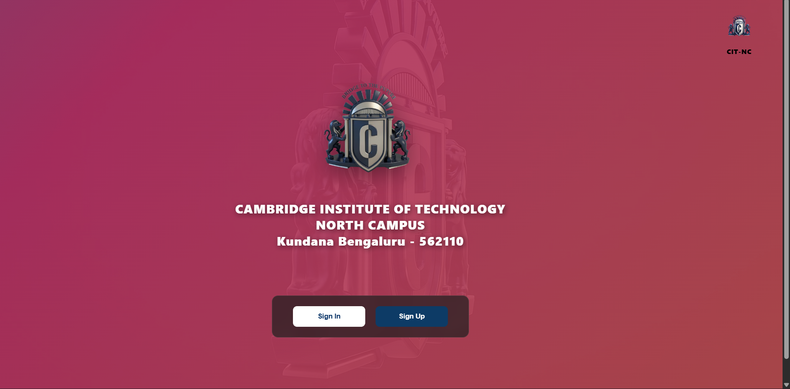
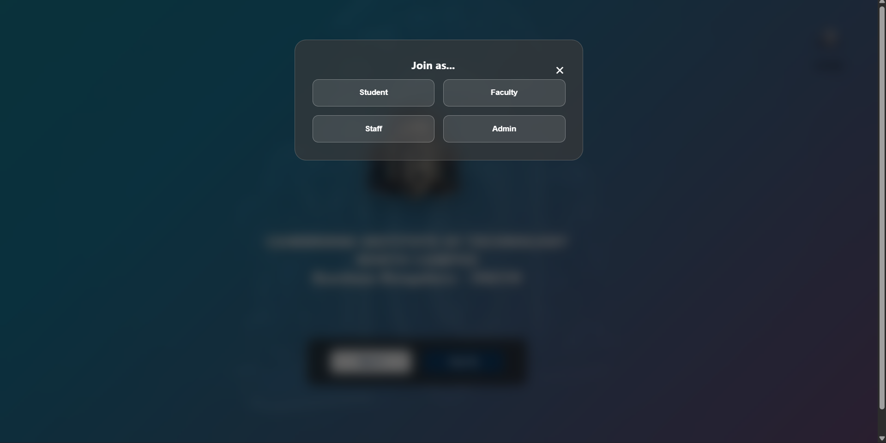
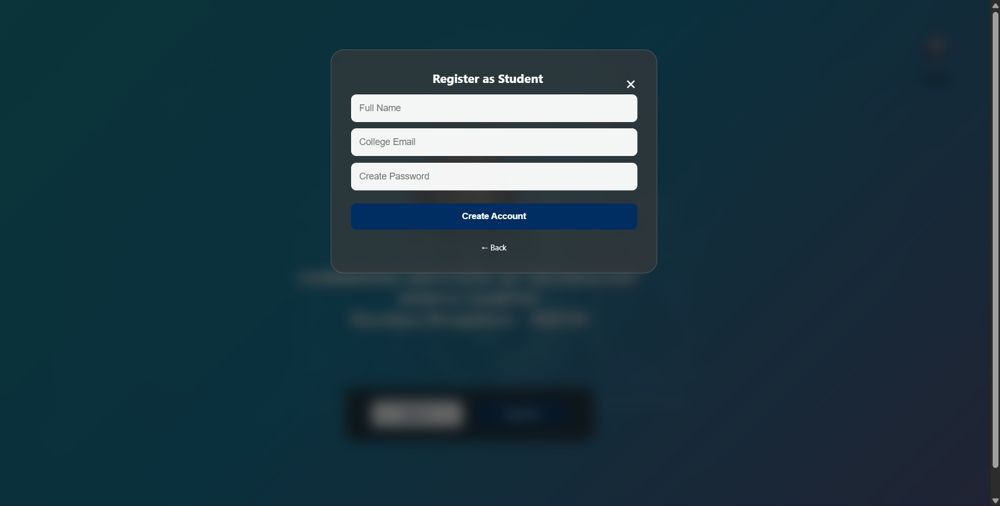
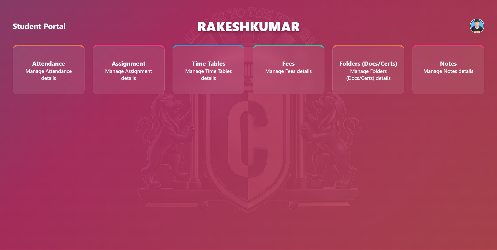
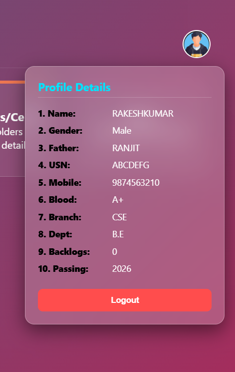
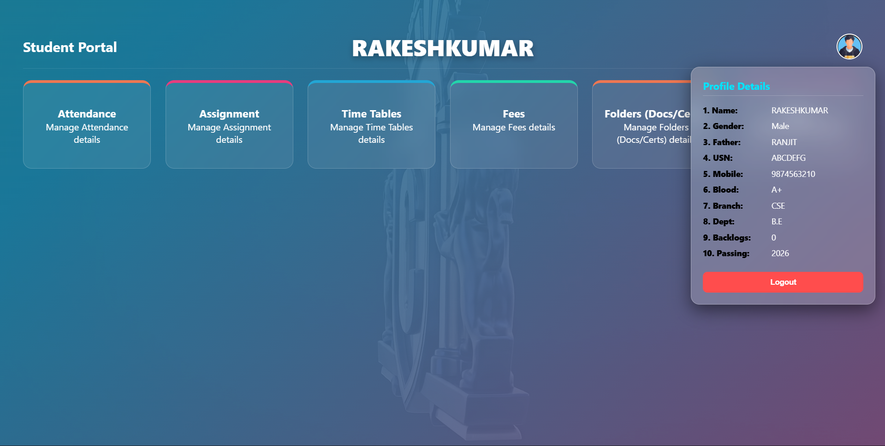

# 🎓 Student Portal System

### Cambridge Institute of Technology – North Campus

<p align="center">
  
</p>

---

## ✨ Live Preview

🔗 https://pawankumar16122114.github.io/Collage_website/

---

## ⚡ Animated Intro

```diff
+ Welcome to the Smart Student Portal 🚀
+ Manage everything in one place
+ Fast • Secure • Modern UI
```

---

## 🧠 About The Project

This is a **modern Student Portal Web Application** designed to manage academic activities such as:

* 📊 Attendance Tracking
* 📝 Assignment Management
* 📅 Time Tables
* 💳 Fees Management
* 📂 Document Storage
* 📓 Notes System

💡 Built with clean UI, animations, and responsive design.

---

## 🎨 Features

✨ Glassmorphism UI
✨ Smooth Animations
✨ Role-Based Access (Student / Faculty / Admin)
✨ Interactive Dashboard
✨ Profile Management System

---

## 🖼️ Project Screens Explained

---

### 🔴 1. Landing Page (Home Screen)

<p align="center">
  
</p>

📌 Description:

* Displays **college branding**
* Includes:

  * Logo (`logo.png`)
  * Title text
  * Sign In / Sign Up buttons

💡 Purpose:

> Entry point for all users into the system

---

### 🟡 2. Role Selection Modal

<p align="center">
  
</p>

📌 Description:

* Users choose their role:

  * Student
  * Faculty
  * Staff
  * Admin

💡 Purpose:

> Enables role-based access control

---

### 🟢 3. Registration Page

<p align="center">
   
</p>

📌 Description:

* Input fields:

  * Full Name
  * College Email
  * Password

💡 Purpose:

> New user account creation

---

### 🔵 4. Dashboard (Main Panel)

<p align="center">
  
</p>

📌 Features:

* Attendance
* Assignments
* Time Tables
* Fees
* Folders
* Notes

💡 UI Highlights:

* Gradient background
* Hover animations
* Card-based layout

---

### 🟣 5. Profile Panel

<p align="center">
  
</p>

📌 Displays:

* Name
* Gender
* USN
* Mobile
* Branch
* Department
* Passing Year

💡 Extra:

* Logout button
* Floating card design

---

### 🟠 6. Full Dashboard View

<p align="center">
  
</p>

📌 Description:

* Complete overview of portal UI
* Clean alignment of all modules

---

## 🏗️ Project Structure

```
Collage_website/
│
├── index.html
├── style.css
├── script.js
│
├── Assets/
│   └── Images/
│       ├── image1.png
│       ├── image2.png
│       ├── image3.png
│       ├── image4.png
│       ├── image5.png
│       ├── image6.png
│       ├── image7.png
│
├── logo.png
├── logo2.png
├── boy.png
├── woman.png
```

---

## ⚙️ Technologies Used

* HTML5
* CSS3
* JavaScript
* GitHub Pages

---

## 🎯 Future Enhancements

🚀 Firebase Authentication
🚀 Database Integration
🚀 AI Chatbot Support
🚀 Dark Mode Toggle
🚀 Mobile Optimization

---

## 🤝 Contributing

Feel free to fork this repo and improve it!

```bash
git clone https://github.com/your-username/Collage_website.git
```

---

## 👨‍💻 Author

**Pawankumar Bukka**

---

## ⭐ Show Your Support

If you like this project:

⭐ Star the repo
🍴 Fork it
📢 Share it

---

## 💥 Final Note

```diff
+ This is not just a project
+ It’s a complete portfolio-level system 🚀
```
